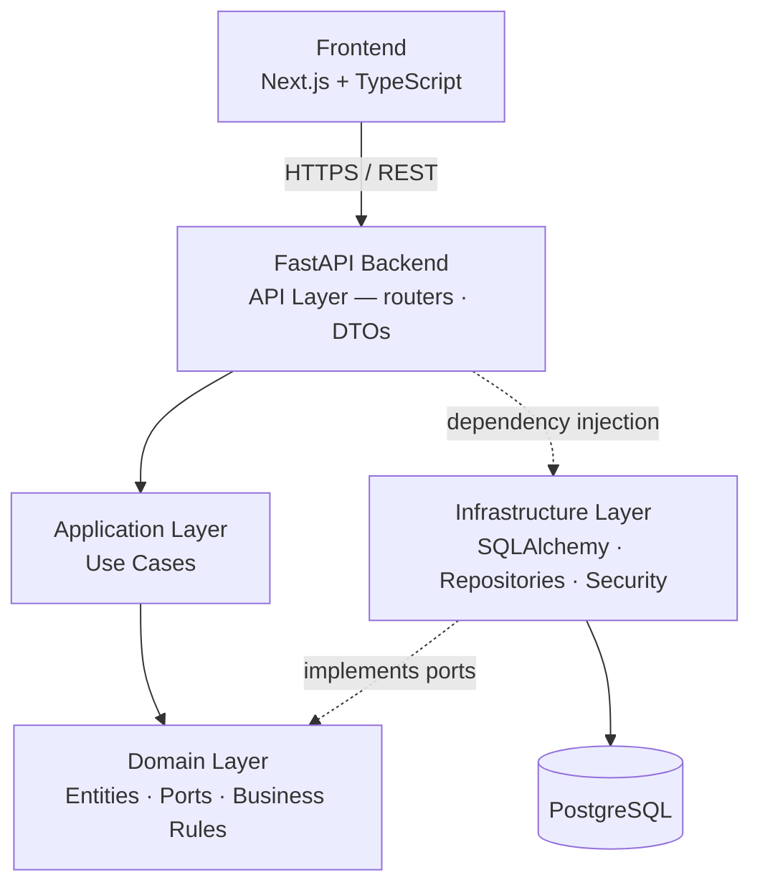

<div align="center">

# 🛡️ SafeAI Platform

**An AI-powered personal safety platform built with security-first engineering principles.**


</div>

> **Status:** Phase 2 complete — authentication and reusable backend foundations
> are implemented and tested. Emergency workflows and AI safety intelligence are
> on the [roadmap](#roadmap). This README documents **only what is implemented**.

---

## Overview

SafeAI is designed to provide secure emergency-assistance workflows through
modern backend architecture, authentication, privacy-aware data handling, and
scalable system foundations. It targets **personal safety for at-risk users**,
where the confidentiality of identity and (future) location data is a
life-safety concern rather than an ordinary privacy matter — so security and
privacy are treated as first-class engineering requirements from day one.

The codebase is engineered to production standards: a framework-free domain
core, typed boundaries, a real test suite, CI quality gates, and documented,
reasoned technology decisions.

## Current Features

Only implemented, tested functionality is listed here.

### Authentication

- **User registration** — create an account with a unique email and a securely
  hashed password (bcrypt; plaintext is never stored, logged, or returned).
- **User login** — credential verification issuing a signed **JWT** access token.
- **JWT authentication** — stateless, algorithm-pinned tokens with expiry.
- **Protected API endpoints** — a bearer-token dependency resolves the current
  user; protected routes reject missing, malformed, or expired tokens with `401`.

### Backend Architecture

- **Clean Architecture** with a strict inward-pointing dependency rule.
- **Domain-driven design** principles: a framework-free domain of entities and
  ports (interfaces), with technology kept at the edges as replaceable adapters.
- **Separation of layers:**
  - **Domain** — entities, value objects, repository/service ports, domain errors.
  - **Application** — use cases (`RegisterUser`, `AuthenticateUser`).
  - **Infrastructure** — SQLAlchemy models & repositories, bcrypt/JWT adapters.
  - **API** — thin FastAPI controllers, request/response DTOs, dependency wiring.

### Database

- **PostgreSQL** as the primary datastore (local/test runs default to SQLite for
  zero-dependency development).
- **SQLAlchemy 2.x** ORM with a typed, `Mapped[...]` model style.
- **Alembic** migrations — the initial `users` table ships as a versioned,
  reversible migration (verified `upgrade`/`downgrade` and model parity).
- **Reusable ORM column abstractions** — shared helpers for primary keys and
  timestamps that stay portable across PostgreSQL and SQLite.

### API Design

- **Versioned API** under `/api/v1`.
- **Consistent response envelope** — every response is `{ success, data, error, meta }`,
  enforced on all paths (including validation and error responses) by global
  exception handlers.
- **Pagination support** — a reusable `page`/`limit` mechanism with pagination
  metadata in the envelope.
- **Typed dependency injection** — settings, database session, repositories, use
  cases, and the current user are provided via typed FastAPI dependencies.

### Testing

- **pytest** with strict, warnings-as-errors configuration.
- **Unit tests** — domain rules and use cases with in-memory fakes (no DB/HTTP).
- **Integration tests** — repositories and API flows against a real schema.
- **Authentication fixtures** — a shared `auth_headers` fixture for protected-
  endpoint tests.

> ✅ **59 tests passing** · **96.6% coverage** (≥ 85% enforced) · `ruff` + `mypy --strict` clean.

## Architecture

Request flow through the layered backend (dependencies point inward; the
infrastructure layer implements the domain's ports and is wired in at the edge
via dependency injection):



See [`docs/architecture.md`](docs/architecture.md) for the full architecture,
workflow, and security diagrams.

## Technology Stack

| Category | Technologies |
|----------|--------------|
| **Backend** | FastAPI, Python 3.12, Pydantic v2 |
| **Database** | PostgreSQL, SQLAlchemy 2.x, Alembic |
| **Frontend** | Next.js, TypeScript, Tailwind CSS |
| **Infrastructure** | Docker, Docker Compose, GitHub Actions |
| **Testing & Quality** | pytest, mypy, ruff |

Rationale for each choice — with alternatives and trade-offs — is in
[`docs/technology-decisions.md`](docs/technology-decisions.md).

## Engineering Highlights

- **Clean Architecture** — framework-free domain; the dependency rule enforced by layering.
- **Dependency Injection** — a single composition root; inner layers never reach for globals.
- **Repository Pattern** — persistence hidden behind domain-defined ports.
- **Secure API design** — consistent envelope, validated input, safe error hygiene.
- **JWT authentication** — stateless, algorithm-pinned, expiring access tokens.
- **Reusable backend foundations** — shared ORM columns, pagination, typed dependency aliases.
- **Type-safe development** — `mypy --strict` across the backend, TypeScript on the frontend.
- **Automated testing** — unit + integration tests with an enforced coverage gate.

## Security Design

SafeAI treats safety data as sensitive by default. Its security model is
documented in [`docs/security-design.md`](docs/security-design.md) and covers:

- **Privacy-first approach** — data minimization and privacy-by-default design.
- **Authentication and authorization** — hashed credentials, JWT, per-request identity.
- **Threat modeling** — a STRIDE analysis and abuse cases specific to a safety
  product (including the intimate-partner / stalker threat).
- **Secure handling of sensitive safety data** — clear separation of *built* vs
  *planned* controls, with no over-claiming.

## Local Setup

### Prerequisites

- Docker & Docker Compose (recommended), **or**
- Python 3.12+ and Node.js 20+ to run services directly.

### Quick start (Docker)

```bash
cp .env.example .env          # set a strong SAFEAI_JWT_SECRET_KEY
docker compose up --build     # starts PostgreSQL + the API
# → Liveness:   http://localhost:8000/api/v1/health/live
# → Readiness:  http://localhost:8000/api/v1/health/ready
# → API docs:   http://localhost:8000/docs
```

### Run services directly

**Backend** (defaults to local SQLite — no Postgres needed):

```bash
cd backend
python -m venv .venv && source .venv/bin/activate   # Windows: .venv\Scripts\activate
pip install -e ".[dev]"
uvicorn app.main:app --reload                        # http://localhost:8000/docs
```

**Frontend:**

```bash
cd frontend
npm install
npm run dev                                           # http://localhost:3000
```

### Quality gate (same commands as CI)

```bash
# backend
cd backend && ruff check . && ruff format --check . && mypy app && pytest --cov
# frontend
cd frontend && npm run lint && npm run typecheck && npm run build
```

## Documentation

| Document | Purpose |
|----------|---------|
| [architecture.md](docs/architecture.md) | System & Clean Architecture, workflows, security, scaling |
| [security-design.md](docs/security-design.md) | Threat model, abuse cases, privacy-by-design, controls (built vs planned) |
| [technology-decisions.md](docs/technology-decisions.md) | ADR-style rationale for every major choice |
| [database-design.md](docs/database-design.md) | Schema, constraints, indexing, scaling |
| [api-contract.md](docs/api-contract.md) | Endpoint request/response contract |
| [development-roadmap.md](docs/development-roadmap.md) | Phased delivery plan |
| [testing-strategy.md](docs/testing-strategy.md) | Test pyramid, coverage, CI gate |
| [glossary.md](docs/glossary.md) | Plain-language definitions of key concepts |

## Roadmap

### Completed

- **Phase 1 — Architecture foundation:** Clean Architecture skeleton, configuration,
  logging, health/readiness endpoints, database & migration setup, CI quality gate.
- **Phase 2 — Authentication & reusable backend foundations:** registration, login,
  JWT-protected APIs; shared ORM columns, pagination primitives, typed dependency
  injection, and authentication test fixtures.

### Upcoming

- **Phase 3 — Emergency Workflow:**
  - Emergency events
  - SOS lifecycle
  - Emergency contacts
  - Location workflows

### Future

- AI-driven safety recommendations
- Safety intelligence and risk scoring
- Advanced analytics

Full phase detail in [`docs/development-roadmap.md`](docs/development-roadmap.md).

## License

MIT — see [`LICENSE`](LICENSE).

---

<div align="center">
<sub>Engineered with Clean Architecture, tested discipline, and reasoned decisions.</sub>
</div>
